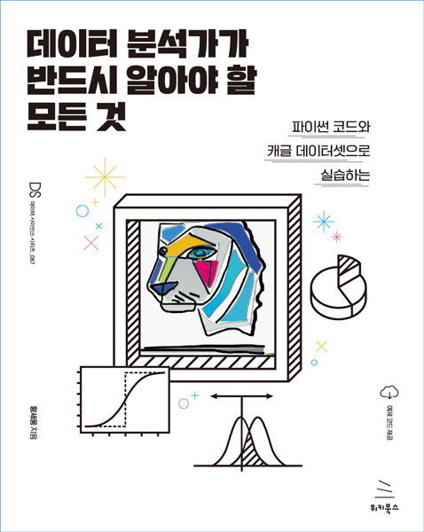

# 데이터 분석가가 반드시 알아야 할 모든 것
### 파이썬 코드와 캐글 데이터셋으로 실습하는

- **황세웅** 지음
- ISBN: 9791158393816
- 판형: 188*240*29mm
- 38,000원 | 2023년 1월 19일 발행 | 636쪽
- [책 홈페이지](https://wikibook.co.kr/eda/)
- [도서 미리보기](http://www.yes24.com/Product/Viewer/Preview/116856857)
- [도서 관련 문의](https://wikibook.co.kr/support/contact/)

---

**데이터 분석과 머신러닝의 각 업무 단계를 깊이 있게 이해하자!**

이 책은 데이터 분석의 기초 체력이라 할 수 있는 통계학부터 필수적인 머신러닝 기법까지를 다룹니다. 처음 비즈니스 문제를 정의하는 단계부터 데이터 준비, 모델링 및 평가, 그리고 스토리텔링까지, 데이터 분석가라면 반드시 알아야 하는 모든 내용이 이 책에 있습니다. 불필요한 수식과 이론을 최소화하고 비전공자라도 개념을 쉽게 이해할 수 있게 구성했습니다. 과거와 현재 데이터로 현상을 올바르게 이해하고 미래를 예측하여 의미 있는 비즈니스 인사이트를 얻는 방법을 이 책에서 배울 수 있습니다.

**★ 이 책에서 다루는 내용 ★**

- 데이터 분석에 필수적인 통계학의 기본 개념
- 데이터 편향과 인지적 편향
- 비즈니스 문제를 정의하고 데이터 분석의 목적을 도출하는 방법
- 데이터 분석 환경 구성
- 데이터 탐색과 시각화
- 주요 머신러닝 알고리즘과 모델 성능 평가 기법
- A/B 테스트와 MAB

---
 
 ## 구입처
 
 - [예스24](http://www.yes24.com/Product/Goods/116856857)
 - [교보문고](https://product.kyobobook.co.kr/detail/S000200640617)
 - [인터파크]()
 - [알라딘](https://www.aladin.co.kr/shop/wproduct.aspx?ItemId=308621189)